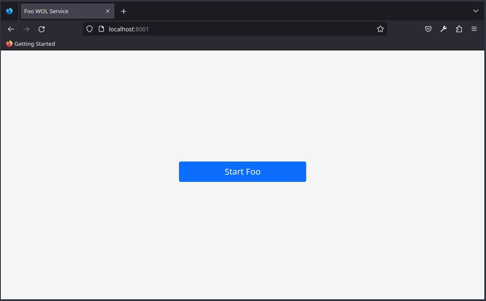

# WOL Proxy

The "WOL Proxy" is intended to be used as a proxy for a website, that displays fallback web service when the server that
runs the actual website is sleeping or shut down.
This service can then be used to up the server via [WakeOnLan](https://en.wikipedia.org/wiki/Wake-on-LAN).



Our use case is a server, that is rarely accessed, but needs lots of power even when idling.
The powerful server has a script, that stops the server if it hasn't been accessed for a certain period of time.
Nginx is running as reverse-proxy on another server on the same network configured similar to the
[nginx config](#nginx-config) below.
It serves the webpage of the powerful server as long as it's accessible and uses a locally running `WOL Proxy`
instance as backup server.
When nginx gets a request and the powerful server isn't running it automatically switches to the backup server and
displays the start button of the `WOL Proxy`.
After the powerful server is started nginx detects after around 10 seconds that it is available again and switches back
to the original web page.

## Config

The config has the following parameters:

| config key        | env variable name   | example             | explanation                                                                                |
| ----------------- | ------------------- | ------------------- | ------------------------------------------------------------------------------------------ |
| listenAddress     | LISTEN_ADDRESS      | `0.0.0.0:8080`      | The address the service listens on.                                                        |
| broadcastAddress  | BCAST_ADDRESS       | `192.168.0.255`     | The address the WOL packet is broadcasted. Should be the broadcast address of your subnet. |
| macAddress        | MAC_ADDRESS         | `01:23:45:67:89:AB` | The MAC address of the target computer (needed for the magic WOL packet)                   |
| serviceName       | SERVICE_NAME        | `My Service`        | The name of your service. Will be displayed on the webpage.                                |
| serverWakeupTime  | SERVER_WAKEUP_TIME  | `60`                | The time in seconds the server needs to start + approx. 10 seconds for nginx to register that the service is working again. |
| serviceAliveRoute | SERVICE_ALIVE_ROUTE | `/api/v1/status`    | A route on which the original service returns a status code that is different to `425 TooEarly`. The client uses it to automatically reload the webpage. |

> see `config.example.yml` in the repo

### nginx Config

Here is an example nginx config with explanations:

```nginx
http {
    # define a new backend
    upstream failover_backend {
        # this is the default address
        server othermachine:8080;
        # this is the backup address that is only used if the primary doesn't work
        server localhost:8080 backup;
    }

    server {
        listen       80;
        server_name  localhost;

        location / {
            # reverse proxy that forwards the connections to the current backend
            proxy_pass http://failover_backend;

            # default proxy headers
            proxy_set_header Host $host;
            proxy_set_header X-Real-IP $remote_addr;
            proxy_set_header X-Forwarded-For $proxy_add_x_forwarded_for;
        }
    }
```

## Build

Simply run:

```bash
go build
```
